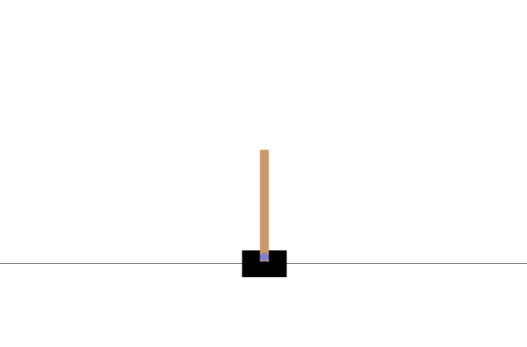

# cartpole-dqn

Solve the cartpole [OpenAI Gym classic control Reinforcement Learning example](https://gym.openai.com/envs/#classic_control)
with Deep [Q-Learning](https://en.wikipedia.org/wiki/Q-learning) approach. 

After about 300 epochs the cartpole starts to balance:

Sample python script showing how to manage RL with Deep Q-Learning. This is the homework assignment of the 9th week for [MMWML course](https://www.machinelearningcourse.io/courses/make-money).
